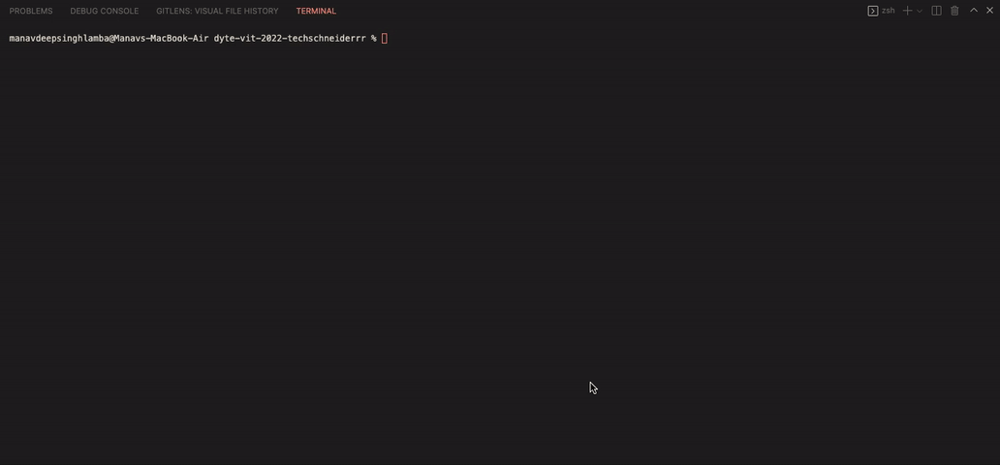

[](https://classroom.github.com/online_ide?assignment_repo_id=7942265&assignment_repo_type=AssignmentRepo)
<div id="top"></div>

<!-- PROJECT LOGO -->
<br />
<div align="center">
  <a href="https://github.com/github_username/repo_name">
    
  </a>

<h3 align="center">myAwesomeTool</h3>

  <p align="center">
    This CLI tool can check if the system has a minimum required version of a dependency installed on it. Moreover, it provides with an option to to update the dependencies to a given version and make a pull request.
  </p>
</div>


<!-- TABLE OF CONTENTS -->
<details>
  <summary>Table of Contents</summary>
  <ol>
    <li>
      <a href="#about-the-project">About The Project</a>
      <ul>
        <li><a href="#built-with">Built With</a></li>
      </ul>
    </li>
    <li>
      <a href="#getting-started">Getting Started</a>
      <ul>
        <li><a href="#prerequisites">Prerequisites</a></li>
        <li><a href="#installation">Installation</a></li>
      </ul>
    </li>
    <li><a href="#usage">Usage</a></li>
    <li><a href="#roadmap">Roadmap</a></li>
    <li><a href="#contributing">Contributing</a></li>
    <li><a href="#license">License</a></li>
    <li><a href="#contact">Contact</a></li>
    <li><a href="#acknowledgments">Acknowledgments</a></li>
  </ol>
</details>


<!-- ABOUT THE PROJECT -->
## About The Project


<div id="commands"></div>
Above is a video demo of all the commands that can be executed after installation of the project. The commands are : 


1. To see all the options available to use in the command.
```sh
myawesometool --help
```


2. To check if the dependency in the projects of repositories listed in the csv file are upto-date or not.
```sh
myawesometool --check <absolute path of the csv file> --for <dependency name> --withVersion <version number>
```


3. To update the dependency in the projects of repositories listed in the csv file that are not upto-date.
```sh
myawesometool --update --check <absolute path of the csv file> --for <dependency name> --withVersion <version number>
```

<p align="right">(<a href="#top">back to top</a>)</p>


### Built With

* [Node.js](https://nodejs.org/en/)

<p align="right">(<a href="#top">back to top</a>)</p>


<!-- GETTING STARTED -->
## Getting Started

This is an example of how you may give instructions on setting up your project locally.
To get a local copy up and running follow these simple example steps.

### Prerequisites

Install the latest version npm
* npm
  ```sh
  npm install npm@latest -g
  ```

### Installation

1. Clone the repo
   ```sh
   git clone https://github.com/dyte-submissions/dyte-vit-2022-techschneiderrr.git
   ```
2. Go to the project directory   
   ```sh
   cd myawesometool
   ```
3. Install NPM packages
   ```sh
   npm install
   ```
4. install the project on you local machine 
   ```sh
   sudo npm i -g
   ```
5. fill your local machine's password
6. Now you are good to go, we can run any command from the given 3 commands given <span>(<a href="#commands">Here</a>)</spanp>.
<p align="right">(<a href="#top">back to top</a>)</p>


<!-- USAGE EXAMPLES
## Usage

Use this space to show useful examples of how a project can be used. Additional screenshots, code examples and demos work well in this space. You may also link to more resources.

_For more examples, please refer to the [Documentation](https://example.com)_

<p align="right">(<a href="#top">back to top</a>)</p> -->


<!-- ROADMAP -->
## Roadmap

- [ x ] Command to check if the dependency in the projects of repositories listed in the csv file are upto-date or not 
- [ ] Command to update the dependency in the projects of repositories listed in the csv file that are not upto-date
    - [ x ] To identify which modules need to sent a pull request
    - [ ] To send a pull request


<p align="right">(<a href="#top">back to top</a>)</p>


<!-- LICENSE -->
## License

Distributed under the MIT License. See `LICENSE.txt` for more information.

<p align="right">(<a href="#top">back to top</a>)</p>


<!-- CONTACT -->
## Contact

Manav Deep Singh Lamba - [@twitter_handle](https://twitter.com/manav_lamba_)

Email - <manavdeep.singhlamba2019@vitstudent.ac.in>

Project Link: [https://github.com/dyte-submissions/dyte-vit-2022-techschneiderrr](https://github.com/dyte-submissions/dyte-vit-2022-techschneiderrr)

<p align="right">(<a href="#top">back to top</a>)</p>


