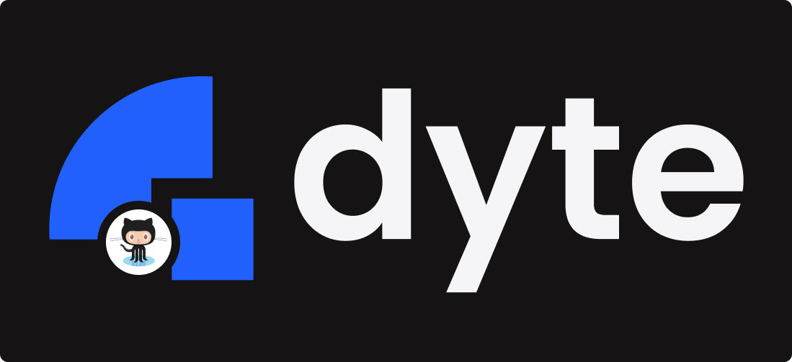
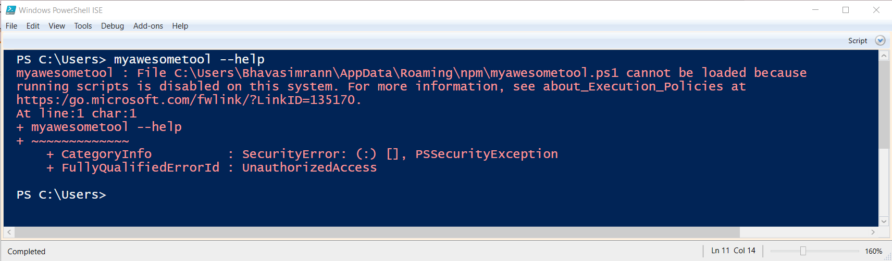
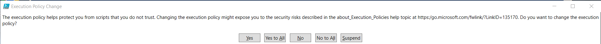
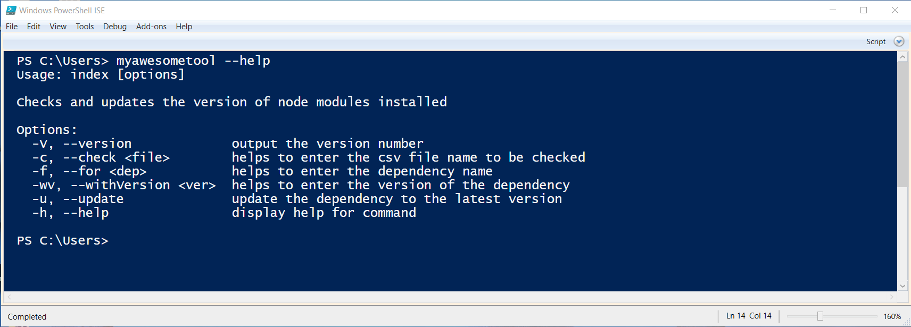

[](https://classroom.github.com/online_ide?assignment_repo_id=7942265&assignment_repo_type=AssignmentRepo)
<div id="top"></div>

<!-- PROJECT LOGO -->
<br />
<div align="center">
  <a href="https://github.com/github_username/repo_name">
    <kbd></kbd>
  </a>

<h3 align="center">myAwesomeTool</h3>

  <p align="center">
    This CLI tool can check if the system has a minimum required version of a dependency installed on it. Moreover, it provides with an option to to update the dependencies to a given version and make a pull request.
  </p>
</div>


## About The Project


<div id="commands"></div>
<p>Above is a video demo of all the commands that can be executed after installation of the project. The complete video demo is available <a href="#vid">here.</a> The commands are : </p>


1. To see all the options available to use in the command.
```sh
myawesometool --help
```
<br>

2. To check if the dependency in the projects of repositories listed in the csv file are upto-date or not.
```sh
myawesometool --check <absolute path of the csv file> --for <dependency name> --withVersion <version number>
```
<br>

3. To update the dependency in the projects of repositories listed in the csv file that are not upto-date.
```sh
myawesometool --update --check <absolute path of the csv file> --for <dependency name> --withVersion <version number>
```
<br>
<p align="right">(<a href="#top">back to top</a>)</p>


### Built With

* [Node.js](https://nodejs.org/en/)

<p align="right">(<a href="#top">back to top</a>)</p>


<!-- GETTING STARTED -->
## Getting Started

This is an example of how you may give instructions on setting up your project locally.
To get a local copy up and running follow these simple example steps.

### Prerequisites

Install the latest version npm
* npm
  ```sh
  npm install npm@latest -g
  ```

### Installation

1. Clone the repo.
   ```sh
   git clone https://github.com/dyte-submissions/dyte-vit-2022-techschneiderrr.git
   ```
2. Go to the project directory.   
   ```sh
   cd myawesometool
   ```
3. Install NPM packages.
   ```sh
   npm install
   ```
4. Update the `.env` file by assigning `PERSONAL_ACCESS_TOKEN` a personal-access-token from your github account. 
5. Install the project on you local machine. 
   ```sh
   sudo npm i -g
   ```
5. Fill your local machine's password.
6. Now you are good to go, we can run any command from the given 3 commands given <span><a href="#commands">Here</a></span>.
<p align="right">(<a href="#top">back to top</a>)</p>


<!-- USAGE EXAMPLES -->
## Errors while tesing on windows

<h4> This error can occur, if you are testing this tool on a windows based machine :</h4>
<kbd></kbd><br><br>

<p>1. To solve this issue run the following command on your shell :</p>

  ```sh
    Set-ExecutionPolicy RemoteSigned -Scope CurrentUser
  ```
<br>

<p>2. The following prompt will appear, simply select `yes to all` option : </p>
<kbd></kbd><br><br>

<p>3. The issue should now be resolved and you should be able to run the commands on your shell.</p>
<kbd></kbd><br><br>


_For more information, please refer to the [Article](https://stackoverflow.com/questions/4037939/powershell-says-execution-of-scripts-is-disabled-on-this-system)_

<p align="right">(<a href="#top">back to top</a>)</p>


<!-- ROADMAP -->
## Roadmap (Features)

- [x] Command to check if the dependency in the projects of repositories listed in the csv file are upto-date or not 
- [x] Command to update the dependency in the projects of repositories listed in the csv file that are not upto-date
    - [x] To identify which modules are required to be updated
    - [x] To send a pull request


<p align="right">(<a href="#top">back to top</a>)</p>


<div id="vid"></div>
<!-- VIDEO DEMO -->

## Video Demo 

https://user-images.githubusercontent.com/56251839/171447946-efc4de1c-aa05-4d5a-bf99-f2db0f9ebcaa.mp4


<!-- LICENSE -->
## License

Distributed under the MIT License. See `LICENSE.txt` for more information.

<p align="right">(<a href="#top">back to top</a>)</p>


<!-- CONTACT -->
## Contact

Manav Deep Singh Lamba - [@twitter_handle](https://twitter.com/manav_lamba_)

Email - <manavdeep.singhlamba2019@vitstudent.ac.in>

Project Link: [https://github.com/dyte-submissions/dyte-vit-2022-techschneiderrr](https://github.com/dyte-submissions/dyte-vit-2022-techschneiderrr)

<p align="right">(<a href="#top">back to top</a>)</p>


